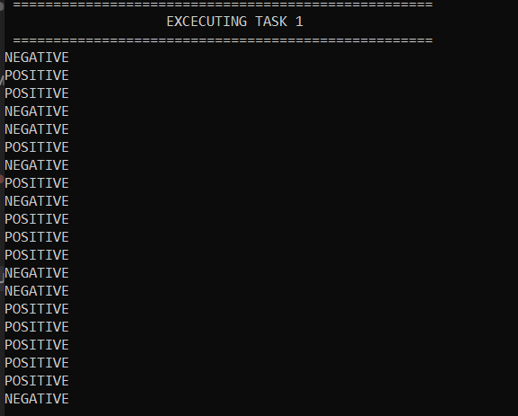
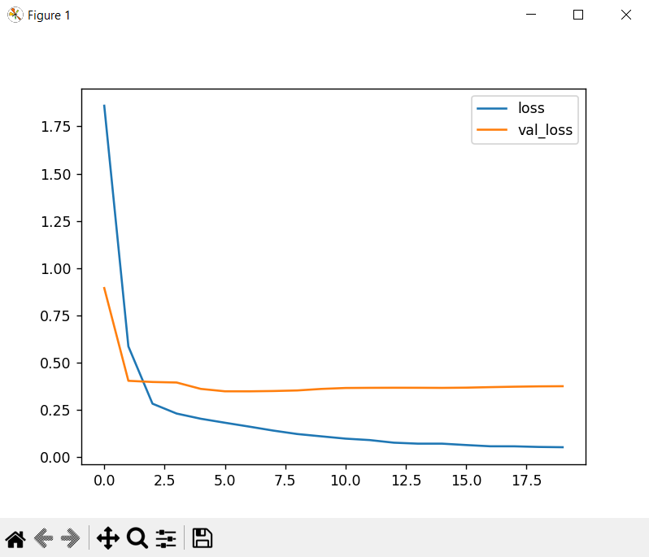
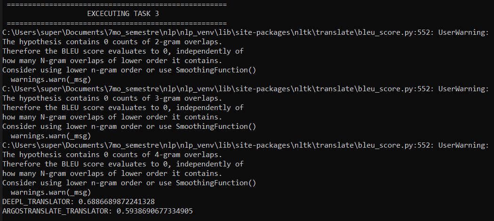
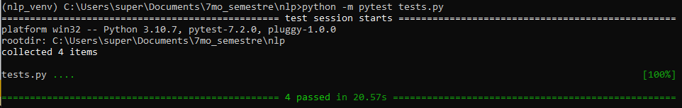
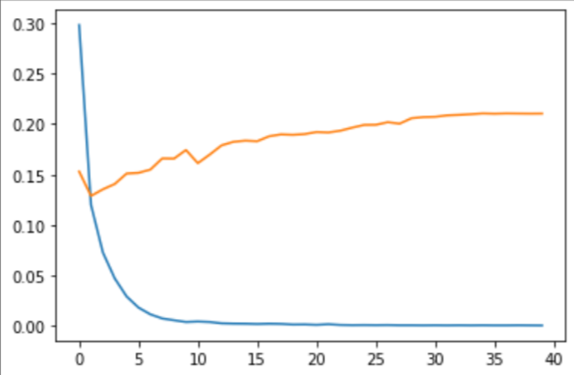
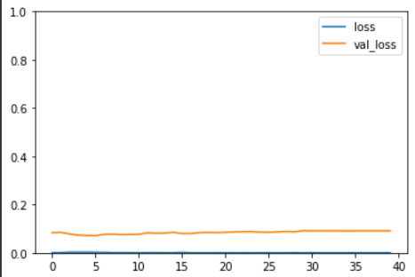

# NLP Module Project - ITESM CEM 
***By: Jose Angel Del Angel Dominguez  A01749386***

## Description

This repo contains my solution of the NLP module project for the advanced AI course, 
on the root dir there is a run.py file that will prompt the user for a Hugging Face API token,
after a valid token is provided the file will print on stdout the solution for each task.

The tasks required are:
1. Evaluate the sentiment of a set of movie reviews (POSITIVE, NEGATIVE) using a pretrained model
2. Retrain a NER model using a dataset with tagged tweets
3. Evaluate the perfomance of two translation APIs using BLEU score

To generate a huggingface token sign-in into huggingface, then go to https://huggingface.co/settings/tokens
and generate a token with permission to read models

### Installing and excecuting code 
* Clone the repository in your local machine
* Open the command line interface (CLI) 
* install the required libraries using ```pip install -r requirements.txt```
* Ensure that you have a huggingface token with permission to read models
* Get a DeepL translator API key at https://www.deepl.com/en/docs-api
* Create a file called ```api_keys.py``` under the dir ```./task_3/```, the file should contain the following:
```
DEEPL_KEY = <your_deepl_api_key_as_str>
# (for gracemikaela@gmail.com a DeepL API key should be available as a canvas comment or file)
```
* run the script using  ```python run.py```


The output generated should be similar to the following:
* for task 1:



* for task 2:



* for task 3:



### Tests: 

To run tests, log in to huggingface cli using your huggingface token an then from the root dir of the repo, call: 
```
python -m pytest tests.py
```
You should get an output as the following:



### Additional notes on Task 2: 

The training loss / validation loss graph when we use the labels found within the twitter dataset is the following:



On the Y axis we have the value of the losses and on the X axis we have the training epochs.

We can see that when using the new labels, model quickly overfits, since validation loss gets stucked on a high value, while the training loss decreases. We can assume this is caused by the low volume of data and the huge number of trainable parameters we have.

To solve this we adopted another aproach that would be useful if we wanted to retrain the model to improve on NER detection on tweets. On this aproach we remap the labels found on the twitter dataset the following way: 
      "company"->"ORG",
      "facility"->"O",
      "geo-loc"->"LOC",
      "movie"->"O",
      "musicartist"->"O",
      "other"->"O",
      "person"->"PER",
      "product"->"O",
      "sportsteam"->"ORG",
      "tvshow"->"O"
If we retrain the model after doing this we have the following results:



As we can se here the model was mostly ready to be used on tweets, since it had low values on the initial training and validation losses. 

However, on the retraining the validation loss reduced a little bit during the first epochs, which led us to a model that is a somewhat better when detecting NER on tweets.

## Authors

Contributors names and contact info:

Jose Angel Del Angel Dominguez  
[joseangeldelangel@gmail.com](mailto:joseangeldelangel@gmail.com)